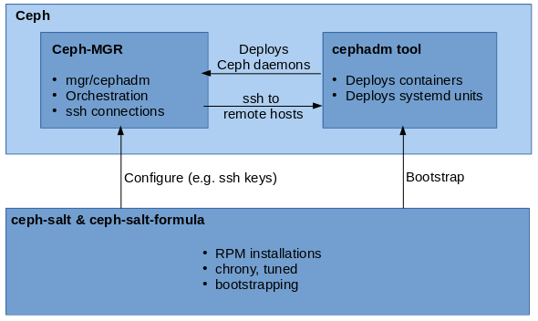

# ceph-salt - Deploy Ceph clusters using cephadm<br/> [](https://travis-ci.com/ceph/ceph-salt) [](https://codecov.io/gh/ceph/ceph-salt)

This project provides tools for deploying [Ceph][ceph] clusters managed by
[cephadm][cephadm] using [Salt][salt]. It delivers missing pieces to fully
manage a Ceph cluster with cephadm:

- OS management (performing OS updates, ntp, tuning)
- Install required RPM dependencies
- Bootstrap cephadm
- Enhanced bootstrapping by defining roles for Salt minions
- Work in progress: Migration from [DeepSea][deepsea] to cephadm

# Components

This repository contains two components:

1. `ceph-salt-formula` is a Salt Formula using Salt Highstates to manage Ceph
   minions.
2. `ceph-salt` is a CLI tool to manage the Salt Formula.

# Architecture



# Setup

In order to use `ceph-salt`, you need a working Salt cluster.

Now, install `ceph-salt` on your Salt Master from the openSUSE
repositories:

```
zypper in ceph-salt
```

Afterwards, reload the salt-master daemon:

```
systemctl restart salt-master
salt \* saltutil.sync_all
```

# Usage

To deploy a Ceph cluster, first run `config` to start the configuration shell to
set the initial deployment of your cluster:

```
ceph-salt config
```

First step of configuration is to add the salt-minions that should be used for
deploying Ceph the command `add` under `/ceph_cluster/minions` option supports
autocomplete and glob expressions:

```
/ceph_cluster/minions add *
```

Then we must specify which minions will have "ceph.conf" and "keyring" installed:

```
/ceph_cluster/roles/admin add *
```

Next step is to specify which minion should be used to run `cephadm bootstrap ...`.
This minion will be the Ceph cluster's first Mon and Mgr.

```
/ceph_cluster/roles/bootstrap set node1.test.com
```

Now we need to set the SSH key pair to be used by the Ceph orchestrator.
The SSH key can be generated by ceph-salt with the following command:

```
/ssh generate
```

We also need to set which minion to use as the time server and add an
external NTP server hostname to sync the time:

```
/time_server/server_hostname set <fqdn of the admin node>
/time_server/external_servers add 0.pt.pool.ntp.org
```

Finally we need to set the Ceph container image path:

```
/containers/images/ceph set docker.io/ceph/daemon-base:latest
```

Afterwards, run `apply` to start the `ceph-salt-formula` and execute the
deployment:

```
ceph-salt apply
```

[ceph]: https://ceph.io/
[salt]: https://www.saltstack.com/
[cephadm]: https://docs.ceph.com/docs/master/mgr/cephadm/
[deepsea]: https://github.com/SUSE/DeepSea
